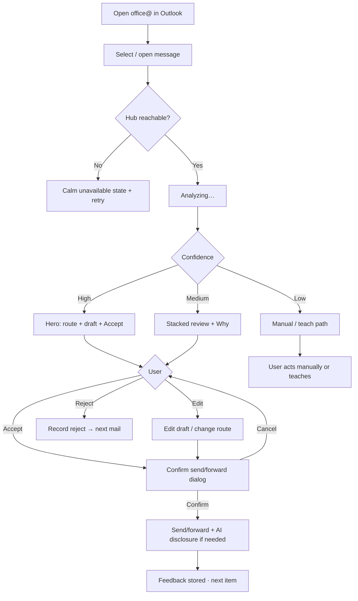
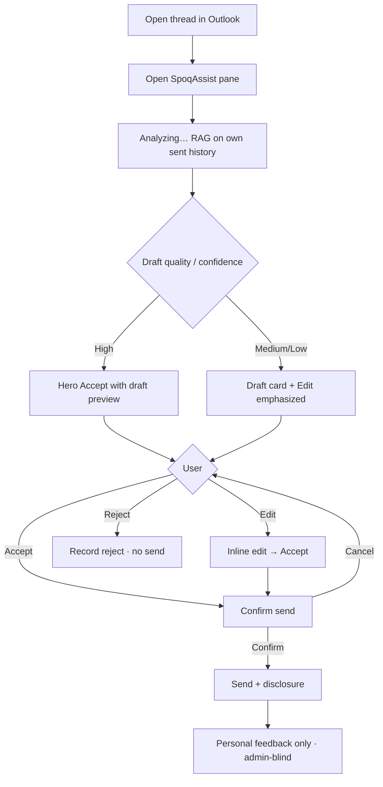
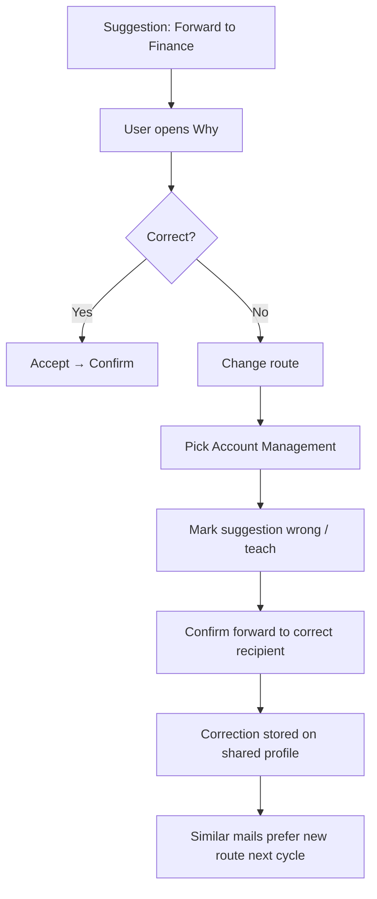
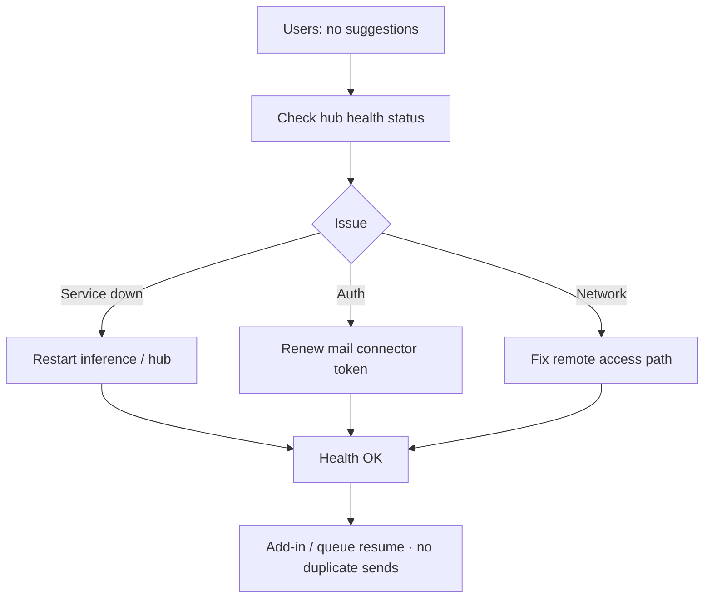

# UX Design Specification SpoqAssist

**Author:** Kevin
**Date:** 2026-07-22

---

## Executive Summary

### Project Vision

SpoqAssist helps internal users handle email faster using company-owned AI—suggestions to categorize, route, draft, and prioritize—with human confirmation before send/forward. The primary experience lives in **Outlook for Mac for all users**. Design optimizes for **low tech-savviness** and measurable time saved (own data + cost as product values, not UX chrome).

### Target Users

- **Shared-mailbox operators** (e.g. office@): high volume; need speed without complexity
- **Personal mailbox users**: drafts that sound like them with minimal edits
- **Secondary:** Ops (hub health), Compliance (disclosure / access register)—lightweight surfaces
- **Platform:** Outlook for Mac assumed for everyone; not all users are highly tech-savvy (“klik en klaar”)

### Key Design Challenges

- Keep HITL flows to 1–2 decisions per mail (Accept / Edit / Reject → Confirm send/forward)
- Surface confidence and “why” without cognitive overload
- Serve shared + personal contexts in Outlook without leaking personal AI data to admins
- Communicate processing latency (up to ~10–30s) calmly and clearly

### Design Opportunities

- Confidence-first ordering so high-confidence items are one-click
- Strong defaults with easy correction (wrong route → fix + teach)
- Style-copy as the personal aha; queue speed as the shared-mailbox aha
- **Outlook-first UX:** web dashboard treated as secondary/optional for heavy batch unless later prioritized; add-in is the daily path

### UX Surface Decision (this release)

| Surface | Role |
|---------|------|
| **Outlook for Mac add-in** | Primary UI for shared + personal mail work |
| **Web dashboard** | Secondary / optional for batch overview; not required for core daily flow |

## Core User Experience

### Defining Experience

The core loop in Outlook for Mac: open a message → review SpoqAssist suggestions (route **and/or** draft, plus category/priority) → Accept or lightly correct → confirm send/forward. Shared and personal users share this loop; shared emphasizes routing + volume, personal emphasizes voice-matched drafts. Both route and draft are first-class.

### Platform Strategy

- **Primary:** Outlook for Mac add-in (mouse/keyboard; task pane / sidebar)
- **Secondary:** web dashboard (optional batch overview)
- Online required (hub + mail); no offline AI suggestions in this release
- Entra sign-in; multi-entity deploy via admin

### Effortless Interactions

- One-click **Accept** on high-confidence (🟢) suggestions
- Confirm send/forward as the only hard gate (HITL)
- Wrong route: change recipient + “teach” without leaving the mail
- Reject = one control, no lecture

### Critical Success Moments

- **Win (shared):** correct route accepted → mail handled without hunting
- **Win (personal):** draft accepted with little/no rewrite — “sounds like me”
- **Fail:** draft feels generic / not person-specific → trust and time-save collapse
- **Fail:** wrong route without easy fix → black-box distrust

### Experience Principles

1. **Two wins, one loop** — route and draft are both first-class; same simple pattern
2. **Klik en klaar** — high confidence = Accept; thinking only when needed
3. **Voice is the product** — personal drafts must feel person-specific or the UX fails
4. **Correct, don’t punish** — easy fix + learn beats perfect first guess
5. **Outlook is home** — don’t send users elsewhere for daily work

## Desired Emotional Response

### Primary Emotional Goals

- **In control** — AI proposes; the user decides
- **Productive / lighter** — same mail, less grind
- **Trusted assistant** — especially when the draft “sounds like me”

### Emotional Journey Mapping

| Stage | Desired feeling |
|-------|-----------------|
| First open add-in | Calm confidence (“this helps”) |
| Core loop (suggest → accept) | Efficient, sure |
| After confirm send/forward | Done / relieved |
| Something wrong | Safe to fix — not blamed or stuck |
| Return next day | Habit / “of course I use this” |

### Micro-Emotions

- **Critical:** Confidence over confusion; Trust over skepticism; Accomplishment over frustration
- **Avoid:** Anxiety (black box), overwhelm (too many choices), embarrassment (wrong send / generic voice)

### Design Implications

| Emotion | UX approach |
|---------|-------------|
| In control | Explicit Confirm on send/forward; Accept ≠ silent send |
| Trust | “Why?” for medium/low; confidence visible but simple |
| Productive | High-confidence first; one-click Accept |
| Safe on error | One-step correct route / edit draft / Reject |
| Voice pride | Surface draft prominently; easy edit before confirm |

### Emotional Design Principles

1. Calm competence over flashy AI
2. Never punish a wrong suggestion — make recovery trivial
3. Person-specific voice is an emotional feature, not a nice-to-have
4. Fewer choices when confidence is high; more clarity when low

## UX Pattern Analysis & Inspiration

### Inspiring Products Analysis

**Outlook for Mac**
- Mail-centric: reading pane + actions close to the message
- Familiar verbs: Reply, Forward, Categorize
- Low learning curve for office staff

**Microsoft Teams**
- Simple primary actions; secondary behind overflow
- Status/activity without jargon overload
- Conversation + action side-by-side patterns

**macOS native (Mail, system UI)**
- Sidebar / inspector panels; clear hierarchy
- Few buttons, obvious defaults
- Native-style confirm for critical actions
- Subtle progress indicators

### Transferable UX Patterns

| Pattern | From | For SpoqAssist |
|---------|------|----------------|
| Actions next to content | Outlook | Suggestions in task pane beside open mail |
| Primary vs secondary actions | Teams / macOS | Accept = primary; Why / Reject = secondary |
| Native confirm | macOS | Confirm send/forward (HITL) |
| Familiar verbs | Outlook | Route / Reply draft / Priority — Outlook language |
| Quiet status | macOS | “Analyzing…” during 10–30s latency |

### Anti-Patterns to Avoid

- Chatbot wall of text / “Ask AI anything” as home
- Dashboard-first daily workflow (forces leave Outlook)
- Neon AI chrome / over-badging
- Too many equal-weight buttons
- Silent auto-send

### Design Inspiration Strategy

**Adopt:** Outlook verbs + pane layout; macOS confirm; Teams-level action simplicity  
**Adapt:** Confidence as quiet labels; “Why” as short disclosure, not essay  
**Avoid:** Generative-AI toy UI; forcing web for daily mail work  

## Design System Foundation

### 1.1 Design System Choice

**Fluent UI (Microsoft)** as the foundation for SpoqAssist — Outlook add-in primary; optional web dashboard shares the same visual language.

### Rationale for Selection

- Matches Outlook / Teams mental model for non-tech-savvy users
- Natural fit for Office Add-ins (Office UI Fabric / Fluent)
- Faster than custom; avoids “foreign AI app” look
- Accessibility and components maintained by Microsoft ecosystem

### Implementation Approach

- Add-in UI built with Fluent React (or current Office Add-in Fluent guidance)
- Prefer Fluent patterns: buttons, dialogs, spinners, message bars, lists
- HITL confirm = Fluent Dialog / native-feel confirm
- Secondary web dashboard: same Fluent theme tokens if built

### Customization Strategy

- Quiet confidence indicators (simple High / Medium / Low or subtle color — not neon AI)
- Company accent color sparingly (primary Accept only)
- Dense-but-readable task pane: Outlook-compatible spacing
- No chatbot chrome; action-first layout

## 2. Core User Experience

### 2.1 Defining Experience

**“Open the mail → SpoqAssist proposes route and/or reply → Accept → Confirm send.”**  
That is the story users tell a colleague. Route and draft are co-equal; both live in one Outlook loop.

### 2.2 User Mental Model

Users think in Outlook verbs (Reply, Forward, Categorize). Today they read → decide → type/forward manually. They expect AI next to the mail, not in another app. Confusion risk: too many AI options or chatbot chat. Expectation: suggest, don’t send alone.

### 2.3 Success Criteria

- “This just works” = Accept on high confidence + confirm, done in seconds of thinking
- Feel smart when draft sounds like them / route was right
- Clear that Confirm is the gate (control)
- Analyzing state feels patient, not broken (≤10s / ≤30s budgets)

### 2.4 Novel UX Patterns

**Established patterns** (Outlook actions + Fluent confirm + task pane).  
**Twist:** confidence-gated simplicity + person-specific draft as the trust proof — not a new gesture to learn.

### 2.5 Experience Mechanics

1. **Initiation:** User selects/opens mail in Outlook; add-in shows suggestions or “Analyzing…”
2. **Interaction:** Review route and/or draft; Accept / Edit / Change route / Reject; optional Why
3. **Feedback:** Quiet confidence; draft preview; errors → one-step fix
4. **Completion:** Confirm send/forward dialog → done; feedback recorded for learning

## Visual Design Foundation

### Color System

**Source:** SPOQ+ portal brand (screenshot reference). SpoqAssist inherits brand identity; Fluent UI provides components and density for Outlook.

| Token | Approx. hex | Role |
|-------|-------------|------|
| `brand.primary` | `#135067` | Sidebar / strong brand; primary filled buttons (“Discover”-style) |
| `brand.primaryHover` | `#0F4054` | Hover/pressed on primary |
| `brand.accent` | `#42AB9A` | High-emphasis CTA (“New order” mint); Accept / positive AI action |
| `brand.accentSoft` | `#CDEFE0` | Tags, soft chips, subtle AI highlight backgrounds |
| `surface.app` | `#F3F7FA` | Task-pane / panel background |
| `surface.card` | `#FFFFFF` | Content blocks, draft preview |
| `text.primary` | `#1A2B33` | Body / titles (near brand dark, not pure black) |
| `text.secondary` | `#5B6B73` | Meta, confidence labels, hints |
| `text.onBrand` | `#FFFFFF` | Text on primary surfaces |
| `text.onAccent` | `#0B2E2A` | Text on mint CTAs (contrast) |
| `link` | `#2B6CB0` | Links / file-style references (portal table pattern) |
| `status.info` | `#2B6CB0` | Neutral/info status dot |
| `status.warning` | `#D4A017` | In-progress / medium confidence |
| `status.danger` | `#D9481F` | Error / reject / destructive |
| `status.success` | `#2F9E7A` | High confidence / success (aligned with accent) |

**Semantic mapping (SpoqAssist):**
- **Primary action (Accept on high confidence):** `brand.accent`
- **Confirm send/forward (HITL gate):** `brand.primary` — deliberate, not “playful mint”
- **Secondary / Edit / Change route:** outline or quiet Fluent secondary on `surface.card`
- **Confidence:** high → success/accent; medium → warning; low → muted secondary (no alarm red unless error)
- **AI presence:** soft accent wash (`accentSoft`), never neon glow

**Accessibility:** WCAG AA for text on surfaces; verify mint-on-white for small text (prefer accent for buttons/icons; use darker success for small labels).

### Typography System

**Tone:** Professional, calm, portal-familiar — not playful, not editorial.

**Fonts:**
- **Outlook add-in / Fluent:** Segoe UI / Fluent type stack (platform-native; no custom brand font required unless SPOQ+ mandates one later)
- **Optional web dashboard:** same stack for consistency with portal sans-serif feel

**Scale (task-pane friendly):**
| Role | Size / weight |
|------|----------------|
| Pane title | 16–18px / semibold |
| Section label | 12–13px / semibold, secondary color |
| Body / draft preview | 14px / regular, line-height ~1.45 |
| Meta (confidence, “Why”) | 12px / regular |
| Button | 14px / semibold |

**Content load:** Short labels + scannable draft preview — not long-form reading. Hierarchy favors actions over chrome.

### Spacing & Layout Foundation

- **Base unit:** 4px; common steps **8 / 12 / 16 / 24**
- **Feel:** Dense and efficient (mail ops), with clear breathing room between suggestion blocks — not airy marketing layout
- **Task pane:** Single column; proposal → actions → optional Why; no multi-card dashboard in the first view
- **Radius:** ~8px on buttons/chips (portal-like); avoid heavy card chrome inside Outlook
- **Layout principles:**
  1. Brand accent marks *action*, not decoration
  2. One decision cluster per mail (route and/or draft + Confirm)
  3. Respect Outlook chrome — SpoqAssist is a focused pane, not a second portal shell

### Accessibility Considerations

- Focus rings visible on Accept / Confirm / Reject
- Don’t rely on color alone for confidence (icon + short label)
- Confirm dialog must be keyboard-completable
- Respect reduced-motion for analyzing states
- Minimum touch/click targets ~32–40px for primary actions

## Design Direction Decision

### Design Directions Explored

Eight Outlook task-pane variations in `ux-design-directions.html`:
1 Brand header · 2 Airy cards · 3 Ops-dense · 4 Hero Accept · 5 Split rails · 6 Tabs · 7 Confirm-first · 8 Wizard-lite

### Chosen Direction

**Hybrid: Direction 2 (airy cards) + Direction 4 (hero Accept).**

- Soft white blocks on `#F3F7FA`, generous spacing, light chrome (calm trust)
- For **high confidence**: one dominant mint **Accept suggestion** that covers route + draft together
- Secondary actions (Edit / Change route / Reject) quieter below the hero
- **Confirm send/forward** remains teal primary — HITL gate always explicit after Accept
- Medium/low confidence: do not force hero; show clearer review (stacked proposals, less “one-click”)

### Design Rationale

- Matches emotional goals: in control, productive, calm trust — not ops-dashboard density as default
- Fits low tech-savviness: one obvious action when SpoqAssist is sure
- Preserves person-specific draft visibility inside the hero (trust proof)
- Avoids tab/wizard friction (6/8) and dual-Accept complexity (5) for the default path
- Shared-mailbox volume can later tighten spacing without abandoning this pattern

### Implementation Approach

- Fluent UI in Outlook add-in; SPOQ+ tokens from Visual Design Foundation
- Default template = airy single-column pane + confidence-gated hero Accept
- States: Analyzing (calm) → High-confidence hero → Accepted → Confirm dialog → Done
- Optional denser list view deferred unless shared-mailbox feedback demands it

## User Journey Flows

### Journey A — Shared mailbox (office@) morning clear

**Goal:** Clear high-volume queue fast with confidence-gated Accept → Confirm.  
**Primary surface:** Outlook for Mac add-in (web dashboard optional for batch overview).  
**Persona:** Lisa (shared-mailbox operator).

### Journey B — Personal draft that sounds like me

**Goal:** Accept a style-matched draft with minimal edits; Confirm before send.  
**Surface:** Outlook add-in only.  
**Persona:** Tom (personal mailbox).

### Journey C — Wrong route recovery

**Goal:** One-step correction preserves trust; learning updates shared routing.  
**Persona:** Lisa on shared mailbox.

### Journey D — Ops hub recovery

**Goal:** Restore suggestions without reading personal mail.  
**Persona:** Sam (IT).

### Journey Patterns

- **Entry:** Always from selected Outlook mail (A/B/C); ops via health surface (D)
- **Decision:** Confidence gates UI (hero vs review vs manual)
- **Mutating outbound:** Accept ≠ send — Confirm is mandatory (FR37)
- **Feedback:** Accept / Edit / Reject / Change route → learning; personal admin-blind
- **Recovery:** Change route + teach in one path; hub errors show calm retry, not fake drafts

### Flow Optimization Principles

- Minimize steps to value: High confidence = Accept → Confirm (2 decisions)
- Progressive disclosure: Why optional; hero hides secondary actions until needed
- Delight = correct route or “sounds like me” draft, not animations
- Errors: one-step fix (reroute / edit / retry hub); never auto-send after outage

## Component Strategy

### Design System Components

**Foundation:** Fluent UI React (v9) + Office.js task pane patterns.

**Use as-is / themed with SPOQ+ tokens:**
- Button, Spinner, Dialog, Textarea, Input, Dropdown/Combobox
- Badge, Tooltip, Link, MessageBar, Persona (optional)
- Focus / keyboard primitives from Fluent

**Theming:** Map `brand.primary`, `brand.accent`, surfaces, and status colors onto Fluent theme tokens — do not fork Fluent chrome.

### Custom Components

#### SuggestionHero
**Purpose:** High-confidence one-click Accept (Dir 4) with airy card (Dir 2).  
**Content:** Confidence chip, route summary and/or draft preview, optional Why link.  
**Actions:** Accept suggestion (primary mint).  
**States:** default, hover, accepting, disabled (hub down).  
**Variants:** route+draft · draft-only · route-only.  
**A11y:** `role="region"` labelled “Suggestion”; Accept is a real button; confidence also as text.

#### SuggestionReviewStack
**Purpose:** Medium/low confidence — stacked review without forcing hero.  
**Content:** Separate route/draft blocks, Why, confidence labels.  
**Actions:** Accept, Edit, Change route, Reject.  
**States:** default, editing, teaching (after wrong route).  
**A11y:** Clear headings per block; Reject not color-only.

#### ConfirmOutboundDialog
**Purpose:** FR37 HITL gate before send/forward.  
**Content:** Action type (send/forward), recipients, short draft excerpt, AI disclosure note if applicable.  
**Actions:** Confirm (teal primary), Cancel.  
**States:** open, confirming, error (send failed), success dismiss.  
**A11y:** Modal focus trap; Escape = Cancel; Confirm not default-focused until review possible.

#### AnalyzingState
**Purpose:** Calm wait within 10s/30s budgets.  
**Content:** Short status (“Analyzing…”) + optional progress hint.  
**States:** analyzing, slow (>budget soft message), failed → HubUnavailable.  
**A11y:** `aria-live="polite"`; respect `prefers-reduced-motion`.

#### HubUnavailable
**Purpose:** Journey D user-facing failure without fake suggestions.  
**Content:** Unavailable message, Retry, optional “IT: check hub health”.  
**Actions:** Retry.  
**States:** offline, auth-expired (prompt re-auth if user-recoverable).

#### WhyExplanation
**Purpose:** Progressive disclosure of rationale.  
**Content:** Short reasons (similar past forwards, keywords) — not model dump.  
**Actions:** Expand/collapse.  
**States:** collapsed, expanded, empty (“Limited history”).

#### RoutePicker
**Purpose:** Journey C recovery — change recipient + teach.  
**Content:** Search/select mailbox or person; “Remember for similar” checkbox if applicable.  
**Actions:** Apply route, Cancel.  
**States:** idle, searching, selected, error.

#### FeedbackControls
**Purpose:** Quiet Accept / Edit / Reject / Change route row under hero or stack.  
**Variants:** compact (under hero) · full (review stack).

#### OpsHealthStatus *(secondary)*
**Purpose:** Journey D — hub/connector reachability without mail content.  
**Content:** Hub OK / degraded / down; last check; connector auth hint.  
**Surface:** Lightweight admin/ops view (not in daily mail pane).

### Component Implementation Strategy

- Compose custom components from Fluent primitives + SPOQ+ tokens
- Outlook add-in is the only Phase-1 shell; optional dashboard reuses same components later
- No chatbot container; action-first regions only
- Confidence never color-only (chip label + icon)

### Implementation Roadmap

**Phase 1 — Core loop:** AnalyzingState, SuggestionHero, FeedbackControls, ConfirmOutboundDialog, HubUnavailable  
**Phase 2 — Recovery & trust:** SuggestionReviewStack, WhyExplanation, RoutePicker  
**Phase 3 — Supporting:** OpsHealthStatus, optional denser queue list if shared-mailbox demand rises

## UX Consistency Patterns

### Button Hierarchy

| Priority | Style | Use for |
|----------|--------|---------|
| 1 | Mint accent (`brand.accent`) | **Accept** on high-confidence hero |
| 2 | Teal primary (`brand.primary`) | **Confirm** send/forward only |
| 3 | Ghost / outline | Edit, Change route, Why, Retry |
| 4 | Quiet danger outline | Reject (never solid red by default) |

**Rules:**
- Accept ≠ send: mint never executes outbound alone
- One primary filled button visible per decision moment
- Confirm dialog: Confirm = teal; Cancel = ghost
- Disable Confirm while send in flight; keep Cancel available until commit starts

### Feedback Patterns

- **Success:** Brief confirmation after send/forward (“Sent” / “Forwarded”) then return to idle/next — no toast spam
- **Error:** MessageBar + one recovery action (Retry, Edit, Change route, Re-auth)
- **Warning:** Medium confidence = review stack, not alarm
- **Info:** Analyzing / hub status via polite live region
- **Learning:** After Reject or Change route, quiet “Thanks — we’ll use this” (one line, dismissible)

### Form Patterns

- Inline edit draft = Fluent Textarea in place; Save/Accept returns to suggestion state
- RoutePicker = searchable combobox; required recipient before Confirm forward
- Validation: block Confirm if recipient empty or draft empty when send requires body
- No multi-page forms in the task pane

### Navigation Patterns

- No app-level nav in the add-in — context = selected Outlook mail
- Optional dashboard (later): sidebar may echo SPOQ+ patterns; daily path stays Outlook
- Deep links: open add-in on current message only
- Ops health is a separate lightweight surface, not in the mail pane chrome

### Additional Patterns

**Modals / overlays**
- Only ConfirmOutboundDialog as blocking modal for mutating outbound
- WhyExplanation = expand-in-place, not modal
- Escape cancels dialogs; focus returns to Accept/FeedbackControls

**Loading**
- AnalyzingState for AI work; Spinner only inside that region
- Slow budget: soft “Still working…” copy; never invent a fake suggestion
- After failure → HubUnavailable, clear previous suggestion

**Empty**
- No mail selected: “Select a message to get suggestions”
- No suggestion / low history: honest empty + manual path, not a hallucinated draft

**Search / filter**
- Not in Phase-1 add-in core loop
- RoutePicker search only for recipients
- Optional dashboard queue filters later (confidence, status)

**AI disclosure**
- Shown in Confirm dialog (and/or outbound footer per compliance) before send of AI-assisted content
- Never bury disclosure only in settings

**Fluent integration rules**
- Prefer Fluent primitives; customize via tokens
- No chatbot transcript UI
- Confidence always label + color

## Responsive Design & Accessibility

### Responsive Strategy

**Primary platform:** Outlook for Mac add-in task pane — desktop mouse/keyboard first.

- **Desktop (Outlook):** Single-column pane; airy hero/review stack; use width for readable draft preview, not multi-column chrome
- **Narrow task pane (~280–350px):** Collapse secondary actions under hero; draft truncates with expand; buttons stack full-width
- **Wide pane / optional dashboard later:** Same components; dashboard may use list + detail, not required for release core
- **Tablet / mobile Outlook:** Out of primary release scope; if Office hosts the add-in smaller, keep single column and ≥40px targets — no separate mobile IA
- **Touch:** Support click-sized targets if trackpad/touch; no gesture-only actions

### Breakpoint Strategy

**Task-pane–first (not classic mobile-first web):**

| Width | Behavior |
|-------|----------|
| `< 300px` | Compact: stacked buttons, shorter draft clamp, confidence chip inline |
| `300–399px` | Default airy pane (Dir 2+4) |
| `≥ 400px` | More draft lines visible; secondary actions can sit in a row |

Optional web dashboard (if built): standard `768` / `1024` for list layouts; reuse tokens/components.

### Accessibility Strategy

**Target: WCAG 2.2 Level AA** (enterprise / internal tool baseline).

- Contrast: text on surfaces ≥ 4.5:1; mint buttons use dark on-accent text; small labels prefer `status.success` over light mint
- Keyboard: full Accept → Edit → Confirm → Cancel path; focus trap in ConfirmOutboundDialog; visible focus rings
- Screen readers: regions for Suggestion / Analyzing; `aria-live` for status; confidence as text not color-only
- Targets: primary actions ≥ 40px (prefer 44px where pane allows)
- Motion: respect `prefers-reduced-motion` on AnalyzingState
- AI Act transparency: disclosure readable in Confirm (not icon-only)

### Testing Strategy

**Responsive / host:**
- Outlook for Mac task pane at min and typical widths
- Safari/WebView behavior used by Office add-ins; Edge/Chrome if dashboard ships

**Accessibility:**
- Keyboard-only walkthrough of Journeys A–C
- VoiceOver on macOS for pane + Confirm dialog
- axe or Fluent-compatible automated checks in CI for add-in UI
- Contrast check on SPOQ+ mint/teal combinations

**Functional a11y-related:**
- Fault injection: hub down → HubUnavailable (no stale Accept)
- Confirm never skipped after Accept (FR37)

### Implementation Guidelines

- Semantic structure in task pane root; label custom regions
- Fluent components preferred for built-in a11y; audit custom composites (SuggestionHero, etc.)
- Rem/spacing tokens from 4px base; avoid fixed px for type where Fluent allows
- Focus return after dialog close to the invoking control
- Don’t rely on hover-only for Why or Reject
- High-contrast: verify Fluent theme + brand tokens still distinguish Accept vs Confirm
